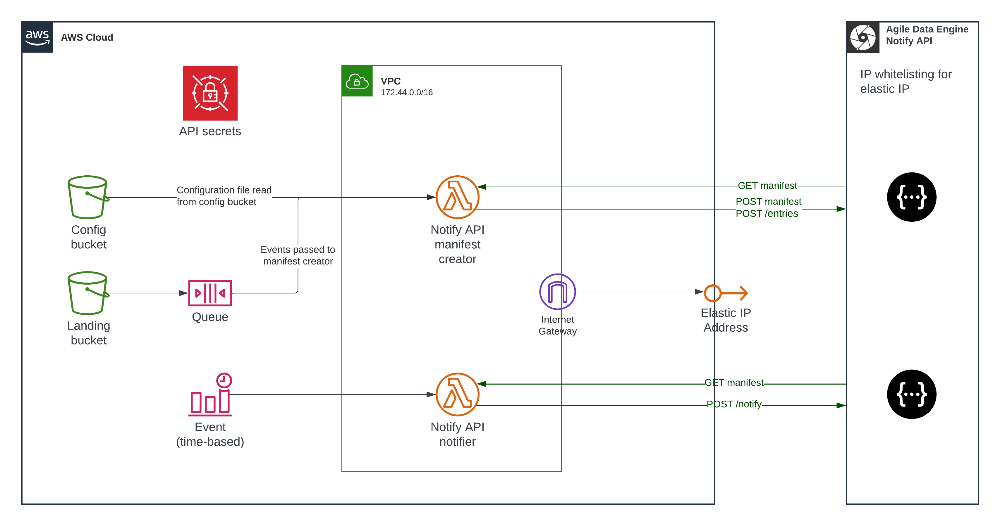

# Agile Data Engine - Reference solution for Notify API with AWS
This repository contains reference solution for Notify API in AWS. This solution is for reference purposes and it may need customer specific modifications. Use with your own caution.

## Pre-requisites
### Infrastructure requirements
- Agile Data Engine's Notify API available
    - AWS Elastic IP will be whitelisted to Notify API's end
    - Notify API access keys available
- AWS account available

### Local deployment pre-requisites
- Docker installed
- AWS CDK installed
- CDK stacks are written in Python, so you need to have that available

## Dependencies
### Libraries
This reference solution uses adenotifier Python library, which is available here: https://github.com/solita/adenotifier. Please use specific version in requirements.txt to prevent issues with library upgrades.

## Deployment
### Using Github Actions
This repository contains .github/workflows/deployment_script.yaml to define Github Actions. Feel free to use the template in your project to deploy this solution.

In github_deployment_role folder, you can find example CDK stack to create OIDC role to be used in Github Actions. More information: https://docs.github.com/en/actions/deployment/security-hardening-your-deployments/configuring-openid-connect-in-amazon-web-services 

### Local deployment
Environment initialization:
```
python3 -m venv .venv
source .venv/bin/activate
pip3 install -r requirements.txt
```

**_NOTE:_** Chech that you have corret AWS profiles set up for AWS CLI

In this example, we will use CDK context method with flag -c. This way, we can use environment specific configuration from cdk.json file by using:
```bash
-c env=<environment>
```

CDK commands for dev environment:
```bash
# Check stack synth
cdk synth -c env=dev

# Deploy only one stack
cdk deploy <stack-name>

# Deploy all stacks
cdk deploy --all -c env=dev
```
## First time usage
1. Update Secrets Manager. There is example secrets manager JSON in secrets_manager_example folder. Use that example and input your ADE installation's Notify API keys and add those to AWS Secrets Manager. This is currently manual step.
2. Upload example file to S3 landing bucket. When uploading a new file, the event should be triggered from S3 to SQS. Monitor manifester Lambda CloudWatch logs to see if everything works.
3. Check out Notify API from Swagger UI and see if manifest was created successfully.
4. Invoke Notifier Lambda function and test out Swagger UI again. With notification, the state should have changed to NOTIFIED.

## Adding new files to be notified
Notification configuration file is specified in adenotifier repository: https://github.com/solita/adenotifier. ID is used to identify the event, so please make sure ID is unique. It can be, for example in the following format:
```bash
# In the following format, if files are prefixed with system name
<source_system>_<table>
# For example
system_test

# In the following format, if files are partitioned by table
<source_system>/<table>
# For example
system/test
```

### Adding new file
Add new table to configuration file. Configuration file can be either JSON or YAML format, it is up to your project to decide.

### Deployment
Notify API configuration is uploaded from notify_api_config/dev/configuration/notify_api_configuration.json to S3 during deployment.

## Example file
There is example file in example_file folder, which is configured in notify_api_config/dev/configuration. You can upload this to example S3 bucket to test out the functionality.

## Architecture
