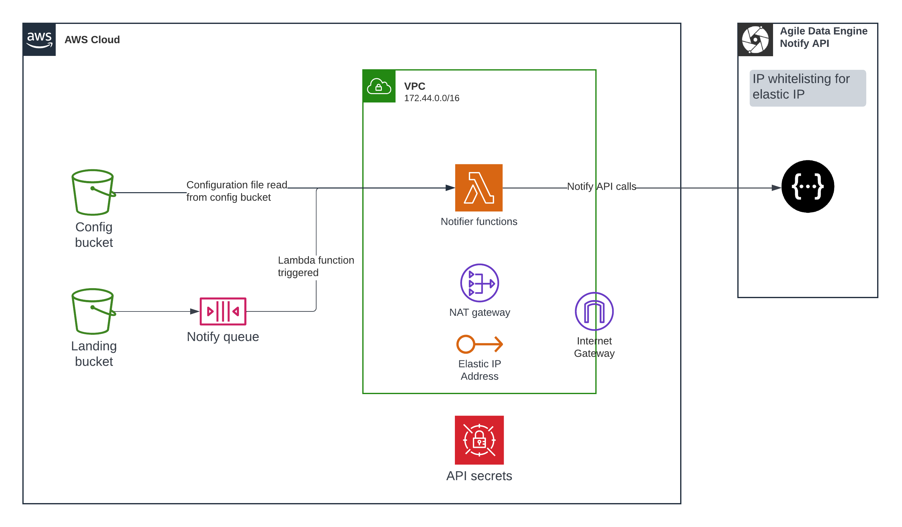
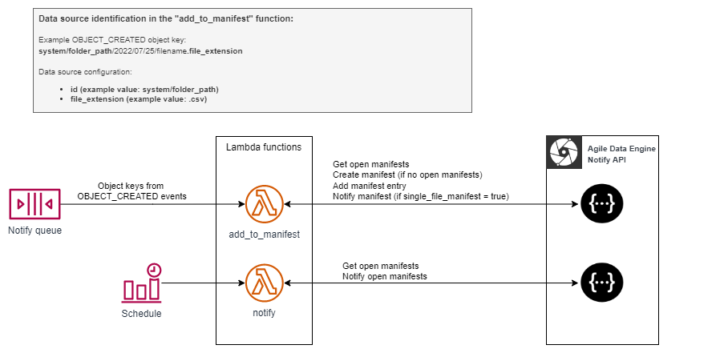

# Introduction
This repository contains a reference solution for notifying incoming source data files for Agile Data Engine Notify API (https://ade.document360.io/docs/notify-api) in AWS. 

**The repository is provided for reference purposes only and the solution may require modifications to fit your use case. Note that this solution is not part of the Agile Data Engine product. Please use at your own caution.**

**Contents:**
- CDK templates for deploying required AWS resources
- Github Actions template to deploy this solution

# Notifier architecture


## Notifying process

1. Source data files are created into S3 bucket by an external process (i.e. not Agile Data Engine nor the Notifier). Landing bucket can be created as part of the Notifier solution or it can be managed separately.
2. Landing bucket has OBJECT_CREATED event type for all objects created to bucket.
3. Events from new objects are sent to SQS queue.
4. New messages in this queue trigger the [add_to_manifest](functions/ade_notify_api/add_to_manifest.py) Lambda function. On default, there is 5 minute batching window in the SQS queue. (Batching window: The maximum amount of time to gather records before invoking the function, in seconds. https://docs.aws.amazon.com/lambda/latest/dg/with-sqs.html)
5. The function gets the environment specific data source configuration file [datasource-config/datasources.json](notify_api_config/dev/datasource-config/datasources.json) from the Notifier configuration S3 bucket and compares the ID and file extension to the configured data sources.
6. If the data source is identified, the function calls Notify API to search for open manifests for the data source.
7. If open manifests are found, the function will add the file to the latest open manifest.
8. If open manifests are not found, a new one will be created and the file added there.
9. If **single_file_manifest** is set to **true** for the data source in the [configuration file](cnotify_api_config/dev/datasource-config/datasources.json), the manifest will also be notified (closed).
10. Notification of data sources where **single_file_manifest** is set to **false** is done with scheduled functions which are triggered on a schedule (cron), i.e. files are collected to an open manifest until a schedule triggers the notification (closing) of that manifest.

Notifying process in detail:


# Dependencies
This solution uses the [adenotifier](https://github.com/solita/adenotifier) Python library. Please specify a version in [requirements.txt](functions/ade_notify_api/requirements.txt) to prevent issues with library upgrades.

# Deployment
## Pre-requisites
### Infrastructure requirements
- Agile Data Engine's Notify API available
    - AWS Elastic IP should be whitelisted to Notify API.
    - Notify API access keys available
- AWS account available

### Local deployment pre-requisites
- Docker installed
- AWS CDK installed
- Example CDK stacks are written in Python

## Using Github Actions
This repository contains .github/workflows/deployment_script.yaml to define Github Actions. Feel free to use the template in your project to deploy this solution.

In github_deployment_role folder, you can find example CDK stack to create OIDC role to be used in Github Actions. More information: https://docs.github.com/en/actions/deployment/security-hardening-your-deployments/configuring-openid-connect-in-amazon-web-services 

## Local deployment
Environment initialization:
```
python3 -m venv .venv
source .venv/bin/activate
pip3 install -r requirements.txt
```

**_NOTE:_** Chech that you have corret AWS profiles set up for AWS CLI

In this example, we will use CDK context method with flag -c. This way, we can use environment specific configuration from cdk.json file by using:
```bash
-c env=<environment>
```

CDK commands for dev environment:
```bash
# Check stack synth
cdk synth -c env=dev

# Deploy only one stack
cdk deploy <stack-name>

# Deploy all stacks
cdk deploy --all -c env=dev
```

# Configuration
## Update Notify API secrets in Secrets Manager
There is example secrets manager JSON in secrets_manager_example folder. Use that example and input your ADE installation's Notify API keys and add those to AWS Secrets Manager.
Agile Data Engine support team will provide the secrets:
- notify-api-key
- notify-api-key-secret

## Provide the public IP addresses to Agile Data Engine support
Agile Data Engine support needs to add the public IP address to the allowed list before the deployed solution can connect to Notify API. If you have deployed multiple environments, provide IP addresses of each environment to the support team.

## Data source configuration
Configure data sources into a configuration file **datasources.json**. CDK will upload configuration file to Notifier configuration bucket. See specifications for the configuration format in the [adenotifier library readme](https://github.com/solita/adenotifier). Unique identifier ID is used for identifying the data source from incoming OBJECT_CREATED events.

In addition, the following can be used to filter based on file_extension:
| Attribute  | Mandatory | Description |
| --- | --- | --- |
| file_extension  | | Optional: File extension of the source file. |

See configuration examples in [config/datasources.json](notify_api_config/dev/datasource-config/datasources.json).

## Testing usage with example file
1. Update Secrets Manager. There is example secrets manager JSON in secrets_manager_example folder. Use that example and input your ADE installation's Notify API keys and add those to AWS Secrets Manager.
2. Upload example file to S3 landing bucket. When uploading a new file, the event should be triggered from S3 to SQS. Monitor add-to-manifest Lambda CloudWatch logs to see if everything works.
3. Check out Notify API from Swagger UI and see if manifest was created successfully.
4. Invoke Notifier Lambda function and check out Swagger UI again. With notification, the state should have changed to NOTIFIED.

## Adding new files to be notified
Notification configuration file is specified in adenotifier repository: https://github.com/solita/adenotifier. ID is used to identify the event, so please make sure ID is unique. It can be, for example in the following format:
```bash
# In the following format, if files are prefixed with system name
<source_system>_<table>
# For example
system_test

# In the following format, if files are partitioned by table
<source_system>/<table>
# For example
system/test
```

### Adding new datasource
Add datasource to the configuration file. Configuration file can be either JSON or YAML format, it is up to your project to decide. In example, there are files in both formats.

You can add new files/tables to be notified in the following way:
1. Update JSON/YAML file in notify_api_config/dev/datasource-config
2. Deploy CDK with Github Actions or other method
3. If new files arrive to landing bucket and ID matches with config file, new notifications are created to Notify API

## Example file
There is example file in example_file folder, which is configured in notify_api_config/dev/configuration. You can upload this to example S3 bucket to test out the functionality.